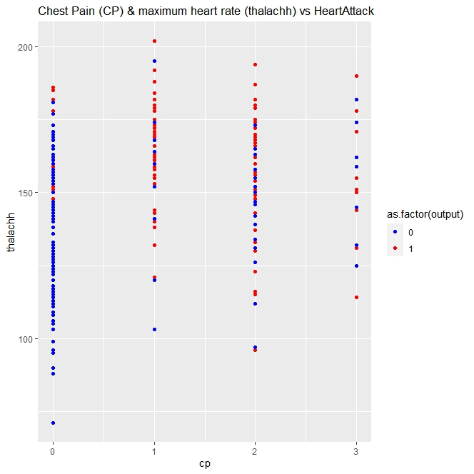
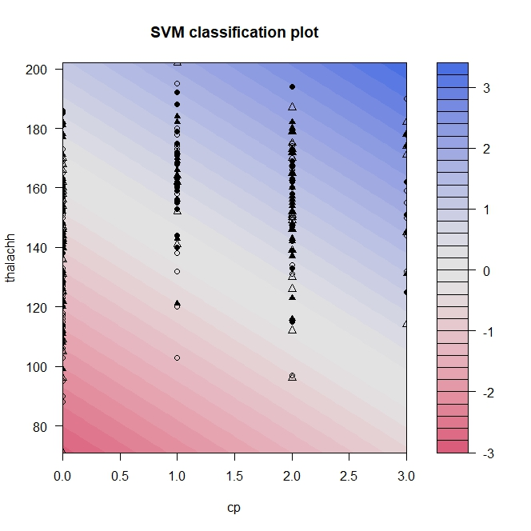

# Support Vector Machine (SVM) example in R

Support Vector Machine (SVM) is a supervised machine learning algorithm. 
SVM is commonly used for classification when some of the data is already classified (e.g. heart-attack vs not heart-attack). 
For linear models, imagine a line separating the two categories (see the image below).

For non-linear models it could be twisted, curved or some other shape that separates the categories. 
In this example, I will show how to model a SVM classifier, then use it to analyze a popular heart-attack dataset. 


## The data

* [Kaggle heart dataset](https://www.kaggle.com/datasets/rashikrahmanpritom/heart-attack-analysis-prediction-dataset)
* Rows 1-13 are predictive
* Row 14 is the category: 0= less chance of heart attack 1= more chance of heart attack
* [Click here to view the detailed data report](https://chardur.github.io/SVM-Example-R/report.html)

## Model

You can view the code for the model in [svm-example.R](https://github.com/chardur/SVM-Example-R/blob/main/svm-example.R) in this repo. A simple linear kernel is used for illustration.


* The data is shuffled to minimize random effects and effects from sorted data
* The data is then split into 3 datasets: Training(train the model), Validation(to choose best model), Test(estimate performance of the model)
* It is important to scale the data when using SVM! I used the R ksvm scaled=TRUE flag


To find the best model I loop through different values of Cost (c) (0.000001 to 100000000). 
I first train the model on the training data, then estimate performance using the validation data. 
Once a model is chosen, it is then tested with the test data to estimate the final performance.

## Analysis

Graphing the relationship between c and accuracy, I found that c values between 0.01 and 10,000 performed best.
 


Lower values of c are less computationally expensive, so I choose c=0.1 for the model. 
Once I chose the model, I measured its performance using the test dataset which resulted in 80% accuracy. 


The mathematical equation for the support vector, including coefficients for the features, was found using the code near line 96:


(0.05689157 * age) - (0.35426058 * sex) + (0.51832134 * cp) - (0.19717111 * trtbps) - (0.19717111 * chol) + (0.11892681 * fbs) + (0.22847900 * restecg) + (0.44512772 * thalachh) - (0.21803852 * exng) - (0.33412498 * oldpeak) + (0.34774562 * slp) - (0.58461516 * caa) - (0.65778699 * thall) + 0.1721164 = 0
 

For linear models the equation will look similar to a1x1 + a2x2 + … anxn + a0 = 0 (where a is some coefficient and x is a predictive variable)

The [data report](https://chardur.github.io/SVM-Example-R/report.html) correlation analysis indicated that CP (chest pain) and thalachh (maximum heart rate) had high correlation with output. Here is a graph with these two features:
 

You can see the support vector in the graph below separating the red and blue shaded areas: 



### Dependencies

* RStudio or similar
* Kernlab library
* optional: DataExplorer library to explore the dataset
* optional: ggplot2 library for final graph

### Executing program

* Run the svm-example.R script in RStudio or similar

```
code blocks for commands
```

## Acknowledgments

* [RASHIK RAHMAN heart dataset](https://www.kaggle.com/datasets/rashikrahmanpritom/heart-attack-analysis-prediction-dataset)
* [Based on GATECH ISYE6501 course, Dr Joel Sokol](https://omscs.gatech.edu/current-courses)
